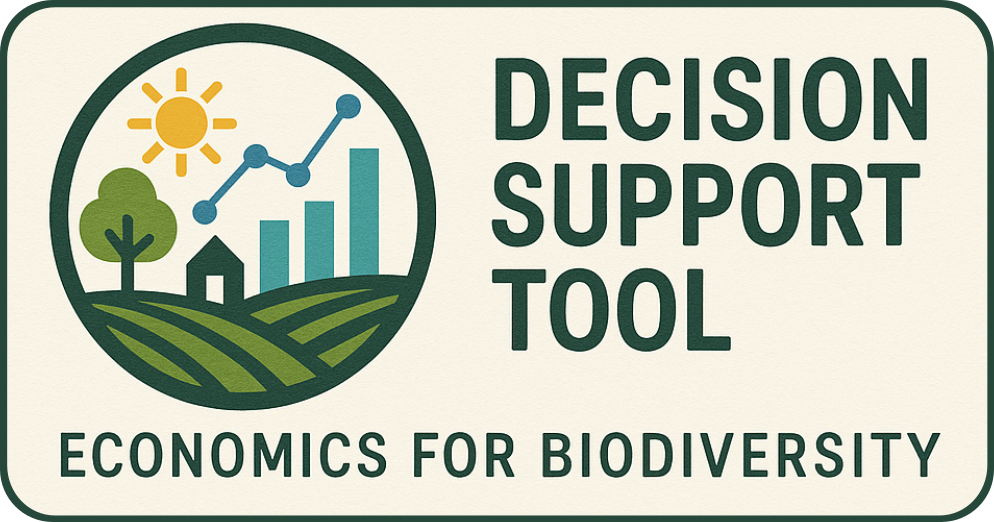

This repository is for development of a tool that explores and supports decision making in the context of land-use, balancing implications on biodiversity with additional considerations such as food production and renewable energy production. This is in alignment with deliverables from the Economics of Biodiversity (EoB) project. 
